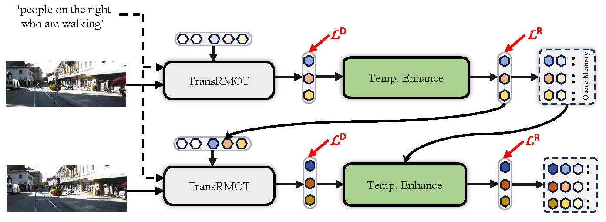

<div align="center">
<h1>
<b>
Bootstrapping Referring Multi-Object Tracking</b>
</h1>
</div>

<p align="center"></p>

> **[Bootstrapping Referring Multi-Object Tracking](http://arxiv.org/abs/2406.05039)**
>
> Yani Zhang, Dongming Wu, Wencheng Han, Xingping Dong

**Abstract.**
Referring multi-object tracking (RMOT) aims at detecting and tracking multiple objects following human instruction represented by a natural language expression. Existing RMOT benchmarks are usually formulated through manual annotations, integrated with static regulations. This approach results in a dearth of notable diversity and a constrained scope of implementation. In this work, our key idea is to bootstrap the task of referring multi-object tracking by introducing discriminative language words as much as possible. In specific, we first develop Refer-KITTI into a large-scale dataset, named Refer-KITTI-V2. It starts with 2,719 manual annotations, addressing the issue of class imbalance and introducing more keywords to make it closer to real-world scenarios compared to Refer-KITTI. They are further expanded to a total of 9,758 annotations by prompting large language models, which create 617 different words, surpassing previous RMOT benchmarks. In addition, the end-to-end framework in RMOT is also bootstrapped by a simple yet elegant temporal advancement strategy, which achieves better performance than previous approaches. 

## Update
- [2024.06.12] Code is released. Paper is released at [arXiv](http://arxiv.org/abs/2406.05039).

## Getting Started
### Installation

The basic environment setup is on top of [MOTR](https://github.com/megvii-research/MOTR), including conda environment, pytorch version and other requirements. 


### Training
You can download COCO pretrained weights from [Deformable DETR](https://github.com/fundamentalvision/Deformable-DETR) ''+ iterative bounding box refinement''.

Then training TempRMOT for Refer-KITTI-V2 as following:
```bash 
sh configs/temp_rmot_train.sh
```

Then training TempRMOT for Refer-KITTI as following:
```bash 
sh configs/temp_rmot_train_rk.sh
```

Note:
- If the RoBERTa is not working well, please download the RoBERTa weights from [Hugging Face](https://huggingface.co/roberta-base/tree/main) for local using.

### Testing
For testing on Refer-KITTI-V2, you can run:
```bash
sh configs/temp_rmot_test.sh
```

For testing on Refer-KITTI, you can run:
```bash
sh configs/temp_rmot_test_rk.sh
```

You can get the main results by runing the evaluation part.
```bash
cd TrackEval/script
sh evaluate_rmot.sh
```

## Main Results

### Ref-KITTI

| **Method** | **Dataset** | **HOTA** | **DetA** | **AssA** | **DetRe** | **DetPr** | **AssRe** | **AssRe** | **LocA** |                                           **URL**                                           |
|:----------:|:-----------:|:--------:|:--------:|:--------:|:---------:|:---------:|:---------:|-----------|----------| :-----------------------------------------------------------------------------------------: |
| TempRMOT  | Refer-KITTI |  52.21   |  40.95   |  66.75   |   55.65   |   59.25   |   71.82   | 87.76     | 90.40    | [model](https://github.com/zyn213/TempRMOT/releases/download/v1.0/checkpoint_rk.pth) |

### Ref-KITTI-V2
| **Method** | **Dataset** | **HOTA** | **DetA** | **AssA** | **DetRe** | **DetPr** | **AssRe** | **AssRe** | **LocA** |                                           **URL**                                           |
|:----------:|:-----------:|:--------:|:--------:|:--------:|:---------:|:---------:|:---------:|-----------|----------| :-----------------------------------------------------------------------------------------: |
| TempRMOT  | Refer-KITTI-V2|  35.04   |  22.97   |  53.58   |   34.23   |   40.41   |   59.50   | 81.29     | 91.19    |  [model](https://github.com/wudongming97/RMOT/releases/download/v1.0/checkpoint_rk2.pth) |


## Citation
```bibtex
@article{zhang2024bootstrapping,
  title={Bootstrapping Referring Multi-Object Tracking},
  author={Zhang, Yani and Wu, Dongming and Han, Wencheng and Dong, Xingping},
  journal={arXiv preprint arXiv:2406.05039},
  year={2024}
}
```

## Acknowledgements
We thank the authors that open the following projects. 
- [RMOT](https://github.com/wudongming97/RMOT)
- [PF-Track](https://github.com/TRI-ML/PF-Track)
- [MOTR](https://github.com/megvii-research/MOTR)
- [Deformable DETR](https://github.com/fundamentalvision/Deformable-DETR)


